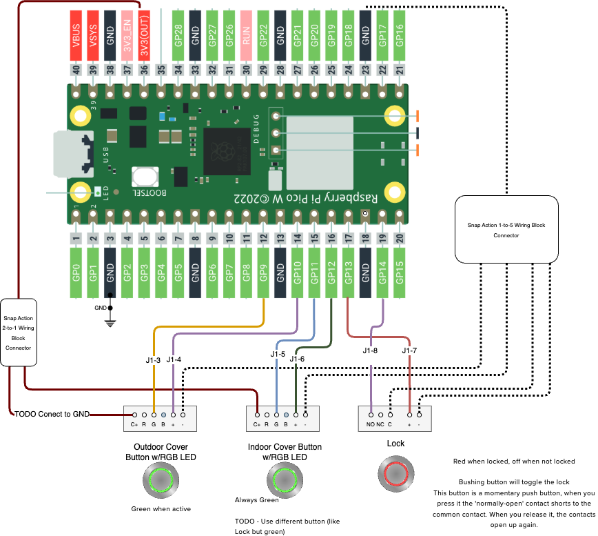

# Wiring

## Wire Table

| Pico       |       OD Button w/LED        |      ID Button w/LED      | LockButton w/RGB LED  |
| ---------- | :--------------------------: | :-----------------------: | :-------------------: |
| 1  GP0     |                              |                           |                       |
| 2  GP1     |                              |                           |                       |
| 4  GP2     |                              |                           |                       |
| 5  GP3     |                              |                           |                       |
| 6  GP4     |                              |                           |                       |
| 7  GP5     |                              |                           |                       |
| 9  GP6     |                              |                           |                       |
| 10 GP7     |                              |                           |                       |
| 11 GP8     |                              |                           |                       |
| 12 GP9     |                              |                           |                       |
| 14 GP10    |                              |                           |                       |
| 15 GP11    |                              |                           |                       |
| 16 GP12    |                              |                           | Unlocked LED (G) GP12 |
| 17 GP13    |                              |                           | Locked LED (R)   GP13 |
| 19 GP14    |                              |  Run LED anode (+) GP14   |                       |
| 20 GP15    | Is Active LED anode (+) GP15 |                           |                       |
| 21 GP16    |  OD Cover Button (NO) GP16   |                           |                       |
| 22 GP17    |                              | ID Cover Button (NO) GP17 |                       |
| 24 GP18    |                              |                           | Lock Button (+) GP18  |
| 25 GP19    |                              |                           |                       |
| 26 GP20    |                              |                           |                       |
| 27 GP21    |                              |                           |                       |
| 29 GP22    |                              |                           |                       |
| 30 RUN     |                              |                           |                       |
| 31 GP26    |                              |                           |                       |
| 32 GP27    |                              |                           |                       |
| 34 GP28    |                              |                           |                       |
| 35 ---     |                              |                           |                       |
| 36 3v3_Out |                              |                           | Common Anode (C+) 3v3 |
| 37 3v3_EN  |                              |                           |                       |
| 38 GND     |          (c,-) GND           |         (c,-) GND         |        (-) GND        |
| 39 VSYS    |                              |                           |                       |
| 40 VBUS    |                              |                           |                       |
