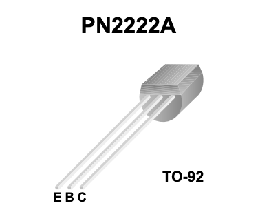
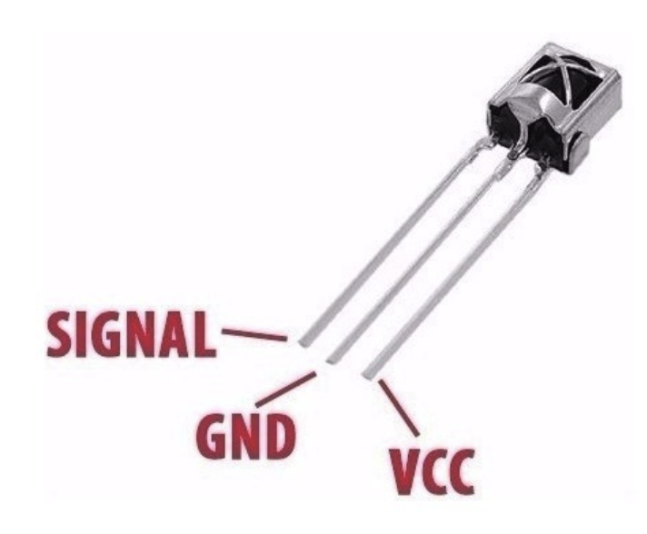

# IR Smart Remote

Based on this [Github project](https://github.com/Cian911/ir-smart-remote) from Cian911.

## Hardware Requirements

* Raspberry Pi Pico W
* IR Receiver (VS1838B or similar)
* IR LED (940nm)
* 2N2222 NPN transistor
* 100Ω (IR LED current limiting)
* 1kΩ (transistor base)
* Breadboard/PCB & jumper wires
* 5V USB power supply

## Pin Outs

### Transistor

|               Flat Forward                |                   Schematic                    |
| :---------------------------------------: | :--------------------------------------------: |
|  |  |

Here is a breakdown of typical 2N2222 connections:

* **Emitter (E)**: Connected directly to ground (or the negative power source).
* **Base (B)**: Connected through a resistor to a control signal.
* **Collector (C)**: Connected to the load, which is connected to positive power.

Flat in front, from left to right (E, B, C)

### IR Receiver

|                Rounded Forward                 |
| :--------------------------------------------: |
|  |

The Infrared Receiver (VS1838B) is typically a 3-pin component. When looking at the front (rounded side) of the component with the pins pointing down, the pinout is generally:

* Left Pin: Signal / Output
* Center Pin: GND (Ground)
* Right Pin: VCC (+3.3V to 5V)

Pin Definitions

* **Signal/Data**: Connects to a digital pin on the Arduino (e.g., D2, D11).
* **GND**: Connects to the GND pin on the Arduino.
* **VCC**: Connects to 5V (or 3.3V) on the Arduino.
